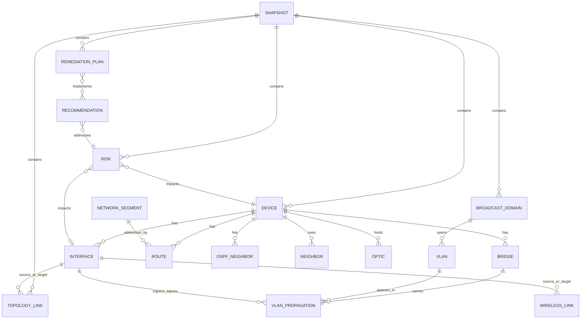

# MikroTik SoT And Topology Intelligence Blueprint

## 1. Current-State Audit

### Observed architecture
- `app_runtime.py` is the effective runtime core and mixes orchestration, reporting, summary aggregation, export lifecycle, and command workflows.
- `models.audit_result.AuditResult` is a transport DTO, report row, workflow state carrier, and partial domain model at the same time.
- `models.device_info.DeviceInfo` stores mostly flattened string aggregates rather than typed infrastructure state.
- `services.collector.MikroTikCollector` performs command execution, parsing, summarization, and business inference in one class.
- `app/*` contains a second offline analyzer model that is not aligned with live collection models.
- `app/topology/*` contains a third model set for topology, with only neighbor/uplink heuristics and no reusable graph layer.
- `report/*` and the writer stack operate on export sections rather than domain entities.

### Main structural gaps
- No canonical Source of Truth schema.
- No temporal snapshot model.
- No separation between raw evidence, normalized facts, inferred facts, risks, and remediation plans.
- No repository abstraction for persistent storage.
- No event bus or async job model for high-scale collection and recomputation.
- No plugin contracts for inference/risk/remediation extension.
- No deterministic correlation engine for VLAN, MAC, LLDP, ARP, bridge host, OSPF, and routes.

### Collector gaps against target state
- Missing or weak coverage for `serial`, `switch-chip`, `routerboard model`, `license level`, `ethernet monitor`, `optics`, `lldp`, `bridge host`, `arp`, `wireless registration-table`, `ethernet switch`, `stp metadata`.
- VLAN extraction is partial and flattened; there is no typed per-port membership matrix or propagation lineage.
- Topology inference is limited to best-effort neighbor and uplink correlation.
- No historical storage for config diff, topology diff, and risk diff.

### Risk of current implementation
- Current outputs are suitable for reports, not for deterministic automation.
- Runtime coupling makes selective recomputation hard.
- String-heavy models block type-safe validation and graph algorithms.
- Export-oriented data shape creates data loss during enrichment because raw evidence and normalized state are not separated.

## 2. Target Platform

### Product outcome
- Network Source of Truth
- MikroTik digital twin
- L2/L3 topology intelligence engine
- Risk and recommendation engine
- Deterministic remediation planning platform

### Architectural style
- Domain-driven, service-oriented backend
- Snapshot-centric Source of Truth
- Async pipeline with stage isolation
- Plugin-based inference/risk/remediation rules
- API-first backend with graph-oriented UI

## 3. Proposed Bounded Contexts

### `inventory`
- Device identity, capabilities, interfaces, optics, bridges, VLANs, addresses, routes, OSPF neighbors.

### `evidence`
- Raw command outputs, parser provenance, command timestamps, collection status, agent metadata.

### `topology`
- Physical links, logical links, broadcast domains, VLAN propagation, transit paths, rings, STP trees.

### `intelligence`
- Roles, inferred topology semantics, broadcast sizing, SPOF detection, weak-edge detection, storm risk, leakage risk.

### `automation`
- Remediation plans, guardrails, dry-run validation, policy checks, generated scripts.

### `presentation`
- Aggregated reports, HTML/PDF export, Draw.io/GraphML export, topology UI projections.

## 4. Canonical Pipeline

```text
collector
  -> raw evidence store
  -> normalizer
  -> correlator
  -> topology engine
  -> inference engine
  -> risk engine
  -> recommendation engine
  -> remediation planner
  -> materialized read models
  -> APIs / UI / reports
```

### Stage responsibilities
- Collector: execute RouterOS commands, preserve raw responses, and attach provenance.
- Normalizer: convert raw RouterOS records into typed domain entities.
- Correlator: merge multiple evidences into canonical device/interface/VLAN facts.
- Topology engine: build multi-layer graphs.
- Inference engine: classify roles and architecture semantics.
- Risk engine: score concrete risks with evidence and blast radius.
- Recommendation engine: map risks and policies to actions.
- Remediation planner: generate deterministic plans and scripts with validation hooks.

## 5. Domain Model

### Core entities
- `Device`
- `Interface`
- `VLAN`
- `Bridge`
- `Neighbor`
- `NetworkSegment`
- `BroadcastDomain`
- `TopologyLink`
- `Ring`
- `WirelessLink`
- `Optic`
- `Route`
- `OSPFNeighbor`
- `VLANPropagation`
- `Risk`
- `Recommendation`
- `RemediationPlan`
- `Snapshot`

### Canonical modeling principles
- Preserve raw evidence separately from normalized facts.
- Use stable IDs for every entity and snapshot version.
- Keep per-interface membership, counters, and health as typed structures.
- Represent relations explicitly rather than packing them into strings.

## 6. ERD



## 7. Storage Architecture

### Recommended production layout
- PostgreSQL for Source of Truth, configuration state, graph metadata, audit history, and APIs.
- ClickHouse for high-volume telemetry and historical event analytics.
- Redis for cache, distributed locks, and hot materializations.
- NATS for event distribution between collector, topology, and intelligence workers.

### PostgreSQL logical schemas
- `inventory`
- `evidence`
- `topology`
- `intelligence`
- `automation`
- `ui_readmodels`

### Core tables
- `snapshots`
- `devices`
- `device_capabilities`
- `interfaces`
- `interface_counters`
- `interface_optics`
- `bridges`
- `bridge_ports`
- `vlans`
- `vlan_memberships`
- `vlan_propagations`
- `neighbors`
- `arp_entries`
- `bridge_hosts`
- `routes`
- `ospf_neighbors`
- `topology_links`
- `broadcast_domains`
- `rings`
- `risks`
- `recommendations`
- `remediation_plans`
- `raw_command_runs`
- `raw_command_payloads`
- `snapshot_diffs`

### Historical model
- Every collection run writes a new snapshot.
- Canonical current-state views are materialized from latest successful snapshot per scope.
- Diff tables store topology, config, and risk changes between snapshots.

## 8. Collector Architecture

### Collection units
- `SystemCollector`
- `InterfaceCollector`
- `BridgeCollector`
- `VLANCollector`
- `NeighborCollector`
- `ARPCollector`
- `BridgeHostCollector`
- `RouteCollector`
- `OSPFCollector`
- `WirelessCollector`
- `OpticCollector`
- `SwitchChipCollector`

### RouterOS commands to cover
- `/system resource`
- `/system routerboard`
- `/interface ethernet print detail`
- `/interface ethernet switch print detail`
- `/interface ethernet monitor [find] once`
- `/interface bridge print detail`
- `/interface bridge port print detail`
- `/interface bridge vlan print detail`
- `/interface lldp neighbors print detail`
- `/interface wireless registration-table print detail`
- `/interface monitor-traffic`
- `/ip address print detail`
- `/ip route print detail`
- `/routing ospf neighbor print detail`
- `/ip arp print detail`
- `/interface bridge host print detail`

### Collector output contract
- Raw command payload
- Parser version
- Command latency
- Device session metadata
- Partial normalized records
- Collection warnings

## 9. Async Execution Model

### Runtime
- FastAPI control plane
- Arq or Dramatiq worker pool for async execution
- NATS subjects for stage transitions

### Job flow
1. API schedules snapshot.
2. Fan-out collectors per device.
3. Persist raw evidence first.
4. Trigger normalization jobs.
5. Trigger correlation/topology computation after all required evidence arrives.
6. Trigger risk and recommendation stages.
7. Materialize UI and report projections.

### Concurrency strategy
- Per-device collection tasks with bounded semaphore pools.
- Per-stage idempotent jobs keyed by `snapshot_id`.
- Incremental recompute for changed devices and impacted broadcast domains.

## 10. Topology Correlation Engine

### Input evidence
- LLDP/CDP neighbor records
- bridge host table
- ARP
- MAC OUI
- wireless registration table
- interface speed/duplex/media
- bridge VLAN membership
- routed adjacencies
- OSPF neighbors

### Correlation passes
1. Identity normalization
2. Interface fingerprinting
3. Neighbor candidate generation
4. Weighted evidence scoring
5. Physical link resolution
6. L2 broadcast domain construction
7. VLAN propagation tracing
8. Transit path and aggregation role inference
9. Ring and SPOF detection

### Link confidence scoring
- LLDP exact remote port: `1.00`
- bridge-host + OUI + MAC adjacency: `0.80`
- ARP + route + uplink heuristic: `0.55`
- comment/name heuristic only: `0.25`

## 11. Inference Engine

### Role outputs
- access_edge
- distribution
- aggregation
- core
- transit
- cpe
- onu
- camera_edge
- radio_backhaul
- wireless_ap
- management_router

### Signals
- VLAN membership density
- MAC density
- LLDP neighbor count and vendor
- optics presence and speed
- bridge host spread
- route adjacency
- traffic/utilization profile
- wireless registration patterns
- comment patterns
- OUI classification

### Plugin model
- Each inference plugin receives immutable snapshot graph and emits typed findings.
- Plugins declare dependencies, confidence, and produced fact types.

## 12. Risk Engine

### Risk families
- L2 storm
- loop exposure
- VLAN leakage
- oversize broadcast domain
- unknown-unicast flooding
- transit overload
- weak edge
- SPOF
- invalid trunk
- management over-propagation
- optics degradation
- interface error/discard anomaly
- bridge host explosion
- platform misuse

### Risk record contract
- rule id
- title
- severity
- confidence
- impacted entities
- evidence
- blast radius
- recommended actions

## 13. Remediation Engine

### Planner responsibilities
- Convert risks into guarded remediation steps.
- Validate preconditions against snapshot.
- Simulate VLAN propagation and domain impact.
- Produce dry-run diff and rollback hints.

### Outputs
- RouterOS script
- human approval summary
- risk acceptance requirement
- expected post-checks

### Guardrails
- No apply without latest successful snapshot.
- No trunk rewrite without propagation simulation.
- No management VLAN changes without alternate reachability proof.

## 14. API Schema

### Core endpoints
- `POST /api/v1/snapshots`
- `GET /api/v1/snapshots/{snapshot_id}`
- `GET /api/v1/devices`
- `GET /api/v1/devices/{device_id}`
- `GET /api/v1/topology/graph`
- `GET /api/v1/topology/layers/{layer}`
- `GET /api/v1/broadcast-domains`
- `GET /api/v1/risks`
- `GET /api/v1/recommendations`
- `POST /api/v1/remediations/plan`
- `POST /api/v1/remediations/validate`
- `GET /api/v1/reports/{report_kind}`

### Graph query response shape
- nodes
- edges
- overlays
- risks
- metrics
- filters metadata

## 15. UI Topology Layer

### Frontend stack
- React
- TypeScript
- Cytoscape.js or React Flow
- Ant Design

### Required views
- physical topology
- L2 topology
- L3 topology
- broadcast domains
- VLAN propagation
- rings
- optics
- wireless links
- risk overlays

### UI behaviors
- snapshot time travel
- path tracing
- VLAN search
- entity drilldown
- filter by vendor/model/risk/severity/domain
- side-by-side topology diff

## 16. Migration Roadmap

### Phase 0: stabilization
- keep current CLI and report interfaces working
- stop further domain leakage into `AuditResult`
- preserve raw outputs for every collection run

### Phase 1: typed SoT foundation
- introduce canonical domain package
- add snapshot metadata
- add repository interfaces
- wrap current collector output into normalization adapters

### Phase 2: collector expansion
- collect LLDP, ARP, bridge host, ethernet switch, monitor, wireless registration, optics
- store raw payloads
- normalize into typed facts

### Phase 3: topology rewrite
- build graph model and correlation passes
- replace current single-hop `infer_links`
- add VLAN propagation and broadcast domain computation

### Phase 4: risk and recommendation engines
- implement plugin contracts
- ship initial high-value rules
- add remediation planner and dry-run validators

### Phase 5: storage and API
- move from output files to PostgreSQL-backed snapshots
- expose FastAPI read/write endpoints
- materialize UI graph models

### Phase 6: UI
- topology explorer
- risk explorer
- entity details
- diff/time-travel views

### Phase 7: deterministic automation
- guarded remediation generation
- validation-before-apply
- change preview and rollback packs

## 17. Immediate Code Refactor Recommendations

### Keep
- existing RouterOS parsing utilities
- current command inventory as bootstrap coverage
- current report writers as export adapters

### Replace incrementally
- `AuditResult` with canonical snapshot entities plus export projection adapters
- `DeviceInfo` with typed device/interface/bridge/VLAN records
- `MikroTikCollector.collect_router_data()` with per-domain collectors
- `TopologyAnalyzer.infer_links()` with a weighted correlation engine

### Introduce anti-corruption layer
- adapters from current `AuditResult` and `DeviceInfo` into the new canonical domain
- section/projector layer to continue serving Excel/NDJSON/Google Sheets until API/UI replace them

## 18. Delivery Priorities

### Highest engineering leverage
1. Canonical typed domain + snapshots
2. Expanded raw evidence collection
3. Topology correlation engine
4. Risk engine
5. FastAPI + PostgreSQL storage
6. UI graph layer

### First production milestones
- deterministic device capability inventory
- accurate VLAN propagation map
- confidence-scored topology graph
- actionable risk report
- safe remediation planning for trunk/access normalization
